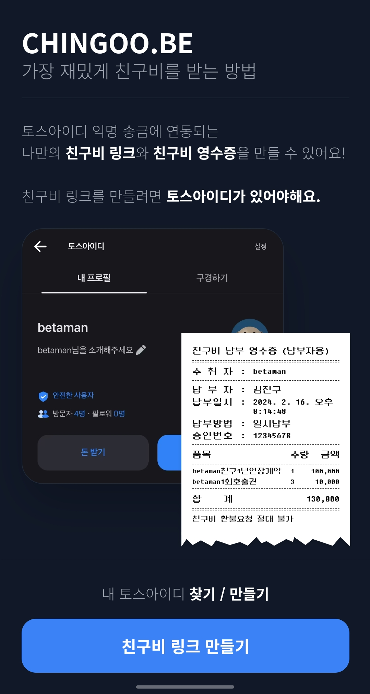

# [CHINGOO.BE](https://chingoo.be)

## 가장 재밌게 친구비를 받는 방법

토스아이디 익명 송금에 연동되는 나만의 **친구비 링크**와 **친구비 영수증**을 만들 수 있어요!

친구비 링크를 만드려면 토스아이디가 있어야해요.

  
  

# Tech stack

별도의 Backend 서비스 없이, Next.js를 통해 Frontend와 Backend를 함께 처리합니다.

| 유형                  | 적용 기술                                      |
| --------------------- | ---------------------------------------------- |
| Node                  | v20.9.0                                        |
| Package Manager       | PNPM 8.14.0                                    |
| Framework             | Next.js 14.1.0 (App router)                    |
| Styling               | Tailwind CSS                                   |
| DB                    | MySQL(PlanetScale)                             |
| ORM                   | Prisma                                         |
| Infra                 | Vercel SaaS                                    |
| Validation            | Superstruct                                    |
| Form                  | react-hook-form                                |
| Monitoring & Analyzer | Google Analytics, Sentry, next-bundle-analyzer |
| Etc                   | Storybook, SVGR, Prettier, ESLint              |
